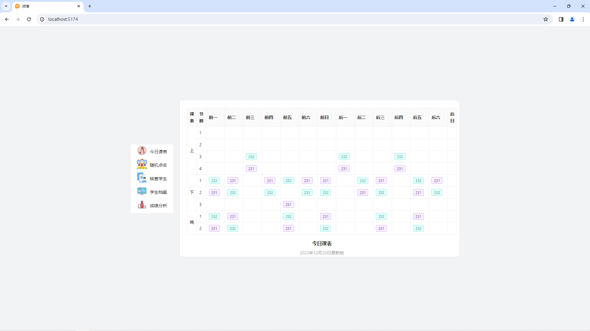
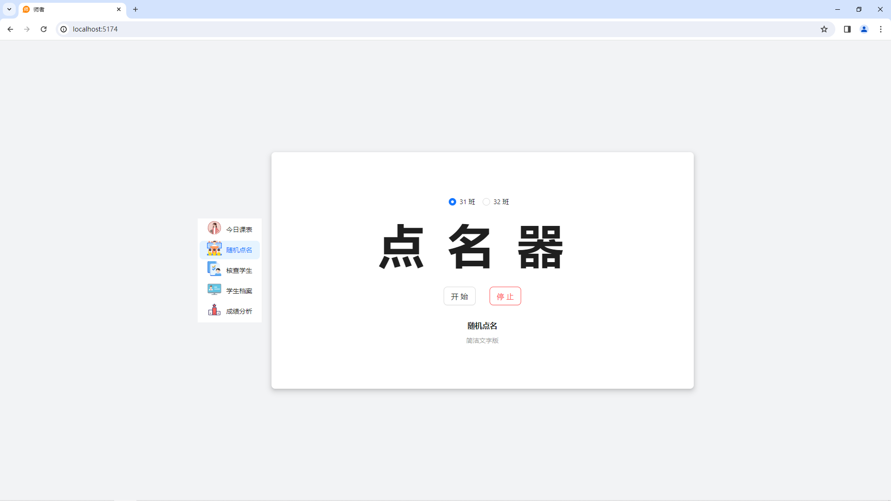
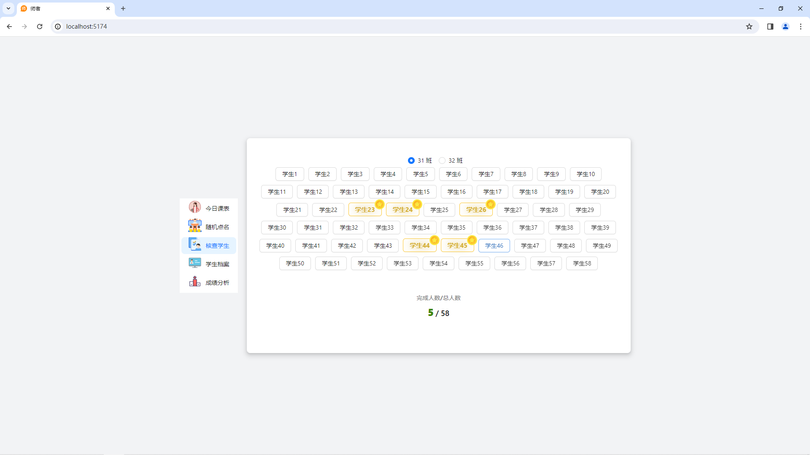
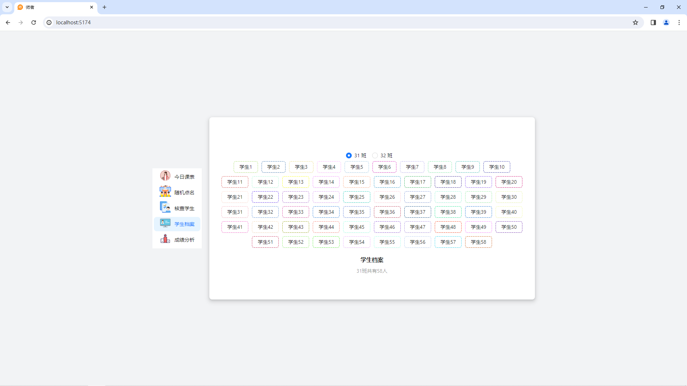
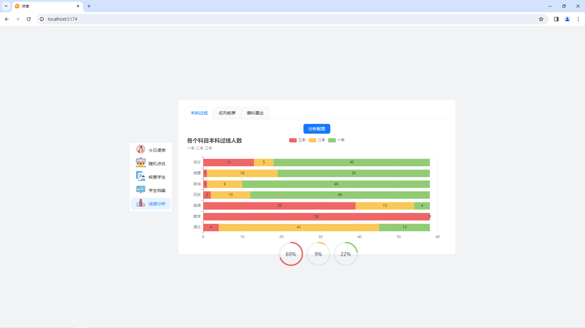
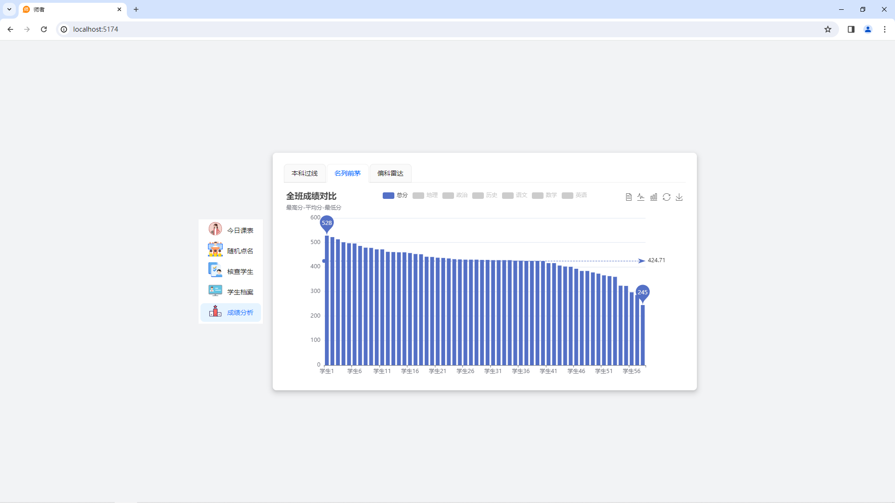
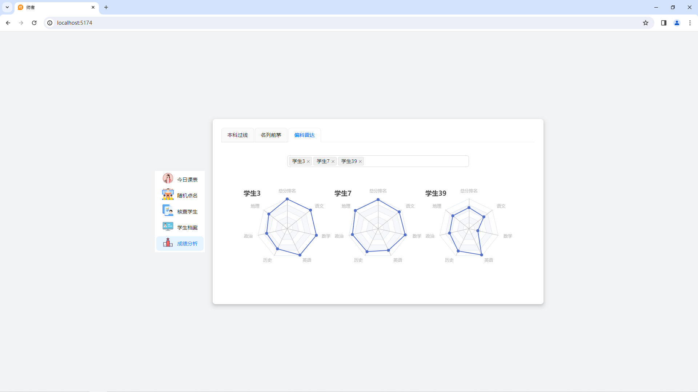

# 自动化教师

旨在于为金子老师减轻一点负担

## 已更新内容

####  今日课表（课程表查阅功能） 

####  随机点名（点名器功能：学生名字动态随机抽取） 

####  核查学生（用于检查学生是否按时完成某项任务，完成点击会出现金色硬币，全部完成会有菜蛋） 

####  学生档案（目前仅支持查询学生名字） 

####  成绩分析（提供班级过线、班级成绩对比、学生成绩对比分析）
######  科目过线柱状图及人数占比

######  全班成绩对比柱状图分析

######  偏科雷达图，可以指定三名学生进行成绩对比

## 未更新内容

- 成绩分析（未完成）
- 课时记录
- 成绩录入
- 学生录入
- ...

